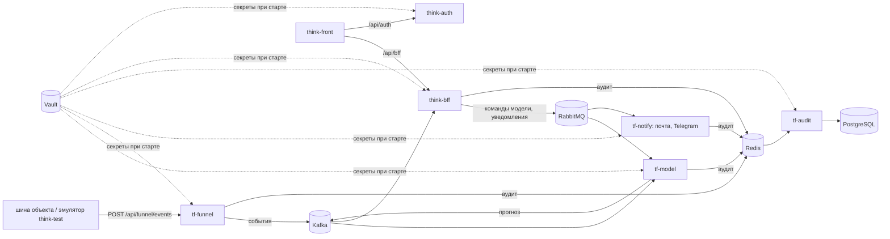

# think-front

Веб-интерфейс Think-Faster: одностраничное приложение на React 19 и TypeScript. Рабочее место
собрано из окон: карта, объекты и датчики, прогнозы, происшествия, заявки, логи, уведомления,
настройки модели, пользователи и группы. Какие окна видит человек, решают его права из BFF.

| Роль | Что делает в интерфейсе |
|---|---|
| диспетчер | смотрит прогнозы и тревоги по своим объектам, подтверждает или отклоняет, создаёт заявки |
| главный диспетчер | задаёт долю тревог, версии модели, окна плановых работ; смотрит аудит отклонённых тревог |
| инженер | получает заявки по своим объектам, отмечает выполнение |
| администратор | пользователи, группы, права, журнал действий |

Интерфейс ходит только в два сервиса, через nginx: [think-bff](https://github.com/Think-Faster/think-bff)
(`/api/bff`) и [think-auth](https://github.com/Think-Faster/think-auth) (`/api/auth`).

## Что где лежит

| Папка | Что внутри |
|---|---|
| [app](app) | приложение: [ARCHITECTURE.md](app/ARCHITECTURE.md) — устройство кода и как добавлять разделы, [SPEC.md](app/SPEC.md) — постановка |
| [app/src/app](app/src/app) | точка входа, маршруты |
| [app/src/core](app/src/core) | API-клиент, вход и обработка 401, права, реестр окон |
| [app/src/entities](app/src/entities) | сущности и репозитории поверх BFF: пользователь, группа, объект, датчик и др. |
| [app/src/features](app/src/features) | разделы интерфейса: `map`, `objects`, `sensors`, `predictions`, `incidents`, `tasks`, `engineer`, `logs`, `dataLog`, `notifications`, `modelSettings`, `users`, `groups`, `access` и др. |
| [app/src/widgets](app/src/widgets) | рабочее место: окна, сетка и режим «внахлёст» |
| [app/src/pages](app/src/pages) | страницы: вход, рабочее место, раздел инженера |
| [app/src/stores](app/src/stores) | состояние на Zustand: вход, права, рабочее место |
| [app/src/shared](app/src/shared) | общие компоненты интерфейса: кнопки, бейджи, фильтры, окно |
| [app/src/styles](app/src/styles) | стили |
| [nginx](nginx) | конфигурация nginx, который отдаёт собранное приложение |
| [deploy](deploy) | Dockerfile, docker-compose и точка входа контейнера |
| [scripts](scripts) | служебный скрипт завершения задачи для разработчика |
| [.github/workflows](.github/workflows) | выкатка: пуш в `prod` собирает образ и выкатывает на [thinkfaster.ru](https://thinkfaster.ru) |

## Запуск локально

```bash
cd app
npm install
npm start
```

## Проект целиком

Think-Faster — сервис прогнозирования инцидентов в инженерных коллекторах (ЛЦТ-2026). Раз в час он
оценивает 78 объектов по журналу событий системы мониторинга и за сутки предупреждает о шести типах
происшествий: пожар, загазованность, подтопление, отказ оборудования, отказ датчика, проникновение.
К тревоге прилагаются основания и рекомендация: что сделать, в какой срок, кого послать. Решение
принимает диспетчер, сервис ничем на объекте не управляет.

| Что | Где |
|---|---|
| Прототип | [thinkfaster.ru](https://thinkfaster.ru) |
| Документация для экспертов: вход, архитектура, решения, методы, соответствие ТЗ, развёртывание, обзор | [think-infra/docs/project](https://github.com/Think-Faster/think-infra/tree/dev/docs/project) |
| Описание системы по сервисам | [think-infra/docs/system](https://github.com/Think-Faster/think-infra/tree/dev/docs/system) |
| Сопроводительная документация по ГОСТ 34.602, модель и исследование | [Think-Faster/docs/документация.md](https://github.com/Think-Faster/Think-Faster/blob/main/docs/документация.md) |

| Репозиторий | Что это | Стек |
|---|---|---|
| [Think-Faster](https://github.com/Think-Faster/Think-Faster) | модель прогноза, приём данных, уведомления, аудит; исследование, датасет, документация | Python, FastAPI, CatBoost, XGBoost, PyTorch; Go |
| [think-front](https://github.com/Think-Faster/think-front) | веб-интерфейс: диспетчер, главный диспетчер, инженер, администратор | React 19, TypeScript, Zustand |
| [think-bff](https://github.com/Think-Faster/think-bff) | API для интерфейса: права, группы, объекты, заявки, прогнозы, настройки модели | .NET 8, ASP.NET Core, EF Core, PostgreSQL |
| [think-auth](https://github.com/Think-Faster/think-auth) | вход и выпуск токенов RS256 | .NET 8, EF Core, PostgreSQL |
| [think-infra](https://github.com/Think-Faster/think-infra) | стенд: Vault, PostgreSQL, Kafka, RabbitMQ, Redis, nginx, почта, Telegram; выкатка | Docker Compose, Bash, GitHub Actions |
| [think-test](https://github.com/Think-Faster/think-test) | эмулятор шины объекта и проверка доступности стенда | Python, Django |



Код, который работает на [thinkfaster.ru](https://thinkfaster.ru): у think-front, think-bff и
think-auth — ветка `prod`; у think-infra — `prod`, документация — `dev`; у Think-Faster и think-test —
`main`.
